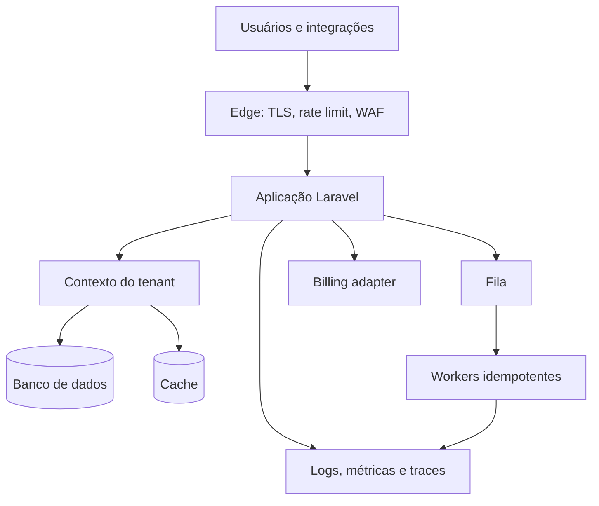

# Laravel SaaS Blueprint

Um mapa arquitetural independente de fornecedor para planejar SaaS multi-tenant em Laravel sem transformar o primeiro release em um monólito impossível de operar.

Este projeto é documentação comunitária. Ele não contém código, regras de negócio ou infraestrutura de produtos comerciais.

## Para quem serve

- Pessoas desenhando seu primeiro SaaS em Laravel.
- Times migrando um sistema single-tenant para multi-tenant.
- Tech leads revisando isolamento, billing, filas e observabilidade.
- Founders que precisam separar MVP de complexidade prematura.

## Visão de arquitetura

## Princípios

1. Resolva o tenant uma vez e carregue o contexto explicitamente.
2. Aplique isolamento também em filas, cache, storage, logs e exports.
3. Trate billing como estado de negócio, não como um único webhook.
4. Torne jobs e webhooks idempotentes desde o início.
5. Defina limites e observabilidade antes de precisar investigar um incidente.
6. Entregue o MVP com a arquitetura mais simples que preserve esses limites.

## Guias

- [Arquitetura e decisões de tenancy](docs/architecture.md)
- [Segurança e isolamento](docs/security.md)
- [Operação, deploy e observabilidade](docs/operations.md)
- [Checklist de MVP](docs/mvp-checklist.md)

## O que este blueprint não prescreve

Ele não obriga banco por tenant, Kubernetes, microserviços ou um provedor específico de pagamento. Essas decisões dependem do risco, escala, equipe e requisitos regulatórios do produto.

## Contribuindo

Proponha melhorias por issue ou pull request. Decisões devem explicar contexto, alternativa e trade-off; evite receitas universais. Antes de participar, leia o [guia de contribuição](CONTRIBUTING.md) e o [código de conduta](CODE_OF_CONDUCT.md).

Para relatar conteúdo que possa incentivar uma prática insegura, siga a [política de segurança](.github/SECURITY.md) e não publique dados de sistemas reais.

- [Escolha uma tarefa para primeira contribuição](https://github.com/asllanmaciel/laravel-saas-blueprint/issues?q=is%3Aissue%20state%3Aopen%20label%3A%22good%20first%20issue%22)
- [Veja todas as tarefas que precisam de ajuda](https://github.com/asllanmaciel/laravel-saas-blueprint/issues?q=is%3Aissue%20state%3Aopen%20label%3A%22help%20wanted%22)

## Licença

[MIT](LICENSE).
